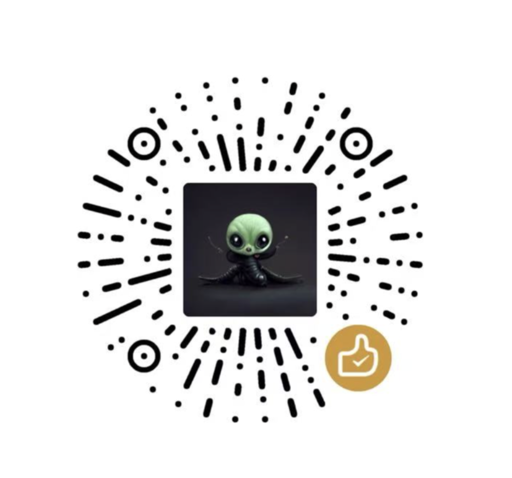

# 🧩 AI Creative Workflow

一个基于 CrewAI 的多 Agent 工作流编排平台，支持多 LLM 提供商和一键部署到 Vercel。

[](https://vercel.com/new/clone?repository-url=https%3A%2F%2Fgithub.com%2Fjoeseesun%2Fqiaoagent&env=OPENAI_API_KEY,ADMIN_PASSWORD&envDescription=API%20Keys%20and%20Admin%20Password&envLink=https%3A%2F%2Fgithub.com%2Fjoeseesun%2Fqiaoagent%2Fblob%2Fmain%2F.env.example&project-name=ai-creative-workflow&repository-name=ai-creative-workflow)

> **🔒 安全提示：** 本项目使用环境变量管理所有敏感信息（API Keys、密码等），代码中不包含任何硬编码的密钥。
>
> 📚 **文档：** [架构设计](./docs/ARCHITECTURE.md) | [安全策略](./docs/SECURITY.md) | [贡献指南](./docs/CONTRIBUTING.md)

## ✨ 功能特性

- 🎯 **多工作流支持** - 预置科技写作、营销文案等多种工作流模板
- 🤖 **多 Agent 协作** - 通过 CrewAI 实现智能 Agent 协同工作
- 🔌 **多 LLM 提供商** - 支持 Tu-Zi、Kimi、DeepSeek、智谱 AI、Gemini 等多个 LLM
- ⚙️ **动态配置** - 后台可视化编辑 Agents、Tasks 和 LLM 提供商，无需重新部署
- 🔒 **安全优先** - 环境变量管理 API Keys，代码中无硬编码密钥
- 🎨 **极简设计** - 黑白灰配色，基于 shadcn/ui 的现代化界面
- 📱 **响应式布局** - 完美支持移动端和桌面端
- 🚀 **一键部署** - 支持 Vercel 无服务器部署

## 🏗️ 技术栈

### 前端
- **Next.js 14** - React 框架
- **TypeScript** - 类型安全
- **Tailwind CSS** - 样式框架
- **shadcn/ui** - UI 组件库
- **Framer Motion** - 动画效果

### 后端
- **FastAPI** - Python Web 框架
- **CrewAI** - 多 Agent 工作流引擎
- **LangChain** - LLM 集成
- **多 LLM 支持** - Tu-Zi (Claude)、Kimi、DeepSeek、智谱 AI、Gemini 等

## 🚀 快速部署

### 方法一：一键部署到 Vercel（推荐）

点击下方按钮，一键部署到 Vercel：

[](https://vercel.com/new/clone?repository-url=https%3A%2F%2Fgithub.com%2Fjoeseesun%2Fqiaoagent&env=OPENAI_API_KEY,ADMIN_PASSWORD&envDescription=API%20Keys%20and%20Admin%20Password&envLink=https%3A%2F%2Fgithub.com%2Fjoeseesun%2Fqiaoagent%2Fblob%2Fmain%2F.env.example&project-name=ai-creative-workflow&repository-name=ai-creative-workflow)

**部署时需要配置的环境变量：**

| 环境变量 | 说明 | 示例 |
|---------|------|------|
| `OPENAI_API_KEY` | Tu-Zi API Key（或其他 LLM 的 API Key） | `sk-xxx...` |
| `ADMIN_PASSWORD` | 管理后台密码 | `your-secure-password` |
| `TUZI_API_KEY` | （可选）Tu-Zi 专用 API Key | `sk-xxx...` |
| `KIMI_API_KEY` | （可选）Kimi API Key | `sk-xxx...` |
| `DEEPSEEK_API_KEY` | （可选）DeepSeek API Key | `sk-xxx...` |
| `ZHIPU_API_KEY` | （可选）智谱 AI API Key | `xxx...` |
| `GEMINI_API_KEY` | （可选）Google Gemini API Key | `AIza...` |

> 💡 **提示：** 至少需要配置一个 LLM 提供商的 API Key。推荐使用 `OPENAI_API_KEY` 作为默认配置。

### 方法二：本地开发

**1. 克隆项目**

```bash
git clone https://github.com/joeseesun/qiaoagent.git
cd qiaoagent
```

**2. 安装依赖**

```bash
npm install
pip install -r requirements.txt
```

**3. 配置环境变量**

```bash
cp .env.example .env
# 编辑 .env 文件，填入你的 API Keys
```

**4. 启动开发服务器**

```bash
npm run dev
```

访问 `http://localhost:3000` 查看应用。

## 🎯 使用指南

### 访问应用

- **主页：** `/` - 工作流执行界面
- **管理后台：** `/admin` - 需要输入管理员密码
  - 工作流管理：`/admin/dashboard`
  - LLM 提供商管理：`/admin/llm-providers`
  - 模型配置：`/admin/workflow-models`

### 配置 LLM 提供商

1. 访问 `/admin/llm-providers`
2. 点击"添加提供商"或编辑现有提供商
3. 配置 Base URL 和模型列表
4. 在环境变量中设置对应的 API Key（如 `KIMI_API_KEY`）
5. 点击"测试连接"验证配置

### 创建工作流

1. 访问 `/admin/dashboard`
2. 点击"创建工作流"
3. 配置 Agents 和 Tasks
4. 为每个 Agent 选择 LLM 提供商和模型
5. 保存并测试工作流


## 📚 文档

- [架构设计](./docs/ARCHITECTURE.md) - 系统架构和设计理念
- [安全策略](./docs/SECURITY.md) - 安全最佳实践和环境变量管理
- [贡献指南](./docs/CONTRIBUTING.md) - 如何为项目做贡献
- [LLM 提供商配置](./docs/ADD_NEW_PROVIDER.md) - 添加新的 LLM 提供商
- [环境变量参考](./docs/ENV_VARS_REFERENCE.md) - 所有环境变量说明

## 🔒 安全

本项目遵循安全最佳实践：

- ✅ 所有敏感信息通过环境变量管理
- ✅ 代码中无硬编码的 API Keys
- ✅ `.env` 文件已在 `.gitignore` 中
- ✅ 支持多种 LLM 提供商的独立 API Key 配置

详见 [安全策略](./docs/SECURITY.md)

## 🤝 贡献

欢迎提交 Issue 和 Pull Request！请查看 [贡献指南](./docs/CONTRIBUTING.md)

## ☕ 支持项目

如果这个项目对你有帮助，欢迎通过以下方式支持：

<div align="center">
  <table>
    <tr>
      <td align="center">
        
        <br/>
        <b>微信打赏</b>
      </td>
      <td align="center">
        
        <br/>
        <b>关注公众号</b>
      </td>
    </tr>
  </table>
</div>

## 📄 许可证

[MIT License](./LICENSE)

## 🙏 致谢

- [CrewAI](https://github.com/joaomdmoura/crewAI) - 多 Agent 工作流引擎
- [Next.js](https://nextjs.org/) - React 框架
- [shadcn/ui](https://ui.shadcn.com/) - UI 组件库
- [Vercel](https://vercel.com/) - 部署平台
- [LangChain](https://www.langchain.com/) - LLM 集成框架

---

**Made with ❤️ by [joeseesun](https://github.com/joeseesun)**
